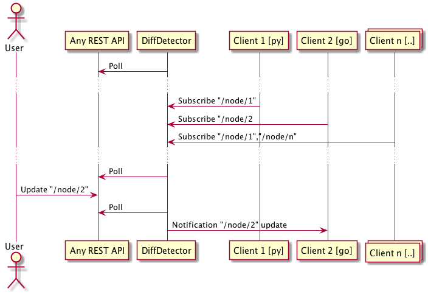

# restful-diff-detector
An application that polls any REST interface and allows other applications to subscribe to changes to the monitored interface and receive notifications over gRPC.

## Description
- **REST interface** - Any REST interface accessible over HTTP
- **restful-diff-detector**
  - Polls **REST interface** at address http://www.yourrestapi.com/
- **clients**
  - Connect to **restful-diff-detector** using gRPC
  - Subscribe to a path in the REST API, for example "http://www.yourrestapi.com//1.1/tweets/0"
  - Receives updates over gRPC from **restful-diff-detector** if subscribed path is updated

**Example sequence**



# Features
1. Serve gRPC interface to clients
1. Polling of REST interface
5. Create example client in Go
4. Create subscription for path in REST
2. ~~Diff result from REST interface~~

## Maybes
6. Use this lib for generating JSON patches instead of changes. http://jsonpatch.com/

# Lessons learnt (not related to application)
### Install
go get -u github.com/golang/lint/golint

### Compile protobuf
```
protoc --go_out=. proto/hello.proto
```

### Update sequence diagram
```
java -jar plantuml.jar sequence.puml
```

### References
[5 tricks for tests in golang](https://medium.com/@matryer/5-simple-tips-and-tricks-for-writing-unit-tests-in-golang-619653f90742)

[pub-sub testing](https://github.com/cskr/pubsub/blob/master/pubsub_test.go)

[golang tutorial](https://tour.golang.org/)

[go: how to shutdown http server](https://stackoverflow.com/questions/39320025/how-to-stop-http-listenandserve)

[testing a gPRC service](https://stackoverflow.com/questions/42102496/testing-a-grpc-service)

